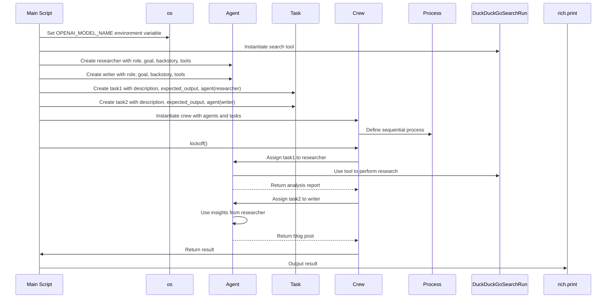

# An example of Agent based architecture based on CrewAI

## Market research demo

```mermaid
sequenceDiagram
    participant Main as Main Script
    participant os as os
    participant Agent as Agent
    participant Task as Task
    participant Crew as Crew
    participant Process as Process
    participant DuckDuckGoSearchRun as DuckDuckGoSearchRun
    participant print as rich.print

    Main->>os: Set OPENAI_MODEL_NAME environment variable
    Main->>DuckDuckGoSearchRun: Instantiate search tool
    Main->>Agent: Create researcher with role, goal, backstory, tools
    Main->>Agent: Create writer with role, goal, backstory, tools
    Main->>Task: Create task1 with description, expected_output, agent(researcher)
    Main->>Task: Create task2 with description, expected_output, agent(writer)
    Main->>Crew: Instantiate crew with agents and tasks
    Crew->>Process: Define sequential process
    Main->>Crew: kickoff()
    Crew->>Agent: Assign task1 to researcher
    Agent->>DuckDuckGoSearchRun: Use tool to perform research
    Agent-->>Crew: Return analysis report
    Crew->>Agent: Assign task2 to writer
    Agent->>Agent: Use insights from researcher
    Agent-->>Crew: Return blog post
    Crew->>Main: Return result
    Main->>print: Output result
```
